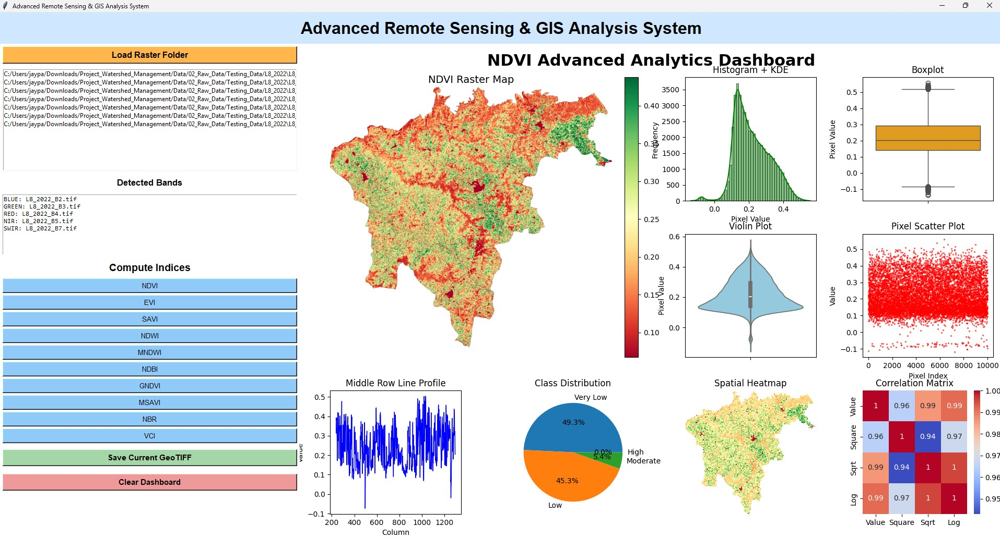

# Advanced Indices Analysis System

  
## Dashboard Preview


 
## Overview

Advanced Indices Analysis System is a Python-based Remote Sensing and GIS analytics platform designed for advanced raster processing, vegetation analysis, spatial visualization, and GeoTIFF analytics.

The system automatically detects raster bands, computes multiple spectral indices, and generates advanced analytical dashboards for environmental monitoring, watershed management, drought analysis, vegetation assessment, and geospatial research.

---

# Features

## Raster Processing

    * Multi-band raster loading
    * Automatic band detection
    * GeoTIFF support
    * Raster visualization

## Supported Indices

    * NDVI
    * EVI
    * SAVI
    * NDWI
    * MNDWI
    * NDBI
    * GNDVI
    * MSAVI
    * NBR
    * VCI

## Advanced Analytics Dashboard

    * NDVI Raster Visualization
    * Histogram + KDE Analysis
    * Boxplot Visualization
    * Violin Plot
    * Scatter Plot
    * Spatial Heatmap
    * Correlation Matrix
    * Line Profile Analysis
    * Class Distribution Pie Chart

## GIS & Remote Sensing Applications

    * Vegetation Monitoring
    * Drought Assessment
    * Watershed Management
    * Environmental Analysis
    * Agricultural Monitoring
    * Spatial Statistics

---

# Technologies Used

    * Python
    * Tkinter
    * Rasterio
    * NumPy
    * Matplotlib
    * Seaborn
    * Scikit-learn
    * GDAL

---

# Project Structure

```text
Project_Watershed_Management/
│
├── Data/
├── Scripts/
├── Outputs/
├── Results/
├── Dashboard/
├── Models/
└── README.md
```

---

# Installation


| Step | Purpose               | Command                                                                                    |
| ---- | --------------------- | ------------------------------------------------------------------------------------------ |
| 1    | Open project folder   | `cd C:\Users\jaypa\OneDrive\Desktop\Advanced-Indices-Analysis-System`                      |
| 2    | Check Git version     | `git --version`                                                                            |
| 3    | Initialize Git        | `git init`                                                                                 |
| 4    | Add all files         | `git add .`                                                                                |
| 5    | Commit files          | `git commit -m "Initial commit: Advanced Indices Analysis System"`                         |
| 6    | Rename branch to main | `git branch -M main`                                                                       |
| 7    | Add GitHub remote     | `git remote add origin https://github.com/jaypalsing/Advanced-Indices-Analysis-System.git` |
| 8    | Check remote          | `git remote -v`                                                                            |
| 9    | Push to GitHub        | `git push -u origin main --force`                                                          |
| 10   | Check status          | `git status`                                                                               |
| 11   | Add future changes    | `git add .`                                                                                |
| 12   | Commit future changes | `git commit -m "Updated project"`                                                          |
| 13   | Push future changes   | `git push`                                                                                 |

## Clone Repository

```bash
git clone https://github.com/jaypalsing/Advanced-Indices-Analysis-System.git
```

## Open Project

```bash
cd Advanced-Indices-Analysis-System
```

## Install Required Libraries

```bash
pip install -r requirements.txt
```

---

# Run Application

```bash
python main.py
```

---

# Workflow

    1. Load Raster Folder
    2. Detect Bands Automatically
    3. Compute Remote Sensing Indices
    4. Generate Spatial Analytics
    5. Visualize Dashboard
    6. Export Processed GeoTIFF

---

# Output Dashboard

The system generates:

    * Raster Maps
    * Statistical Graphs
    * Spatial Heatmaps
    * Correlation Analysis
    * Vegetation Distribution Maps

---

# Research Applications

This project is useful for:

    * Researchers
    * GIS Analysts
    * Environmental Scientists
    * Agriculture Experts
    * Remote Sensing Professionals
    * Students and Developers

---

# Future Enhancements

    * Deep Learning Integration
    * Machine Learning Classification
    * Change Detection
    * Web GIS Dashboard
    * Google Earth Engine Integration
    * Real-Time Satellite Monitoring

---

# Author

Dr. Jaypalsing Kayte

AI Researcher | GIS & Remote Sensing Analyst | Python Developer

---

# License

This project is developed for research and educational purposes.
